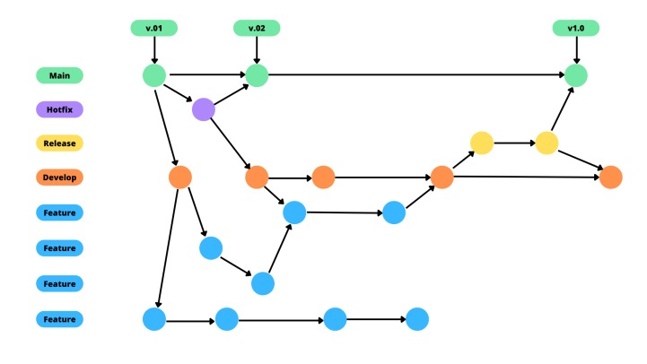
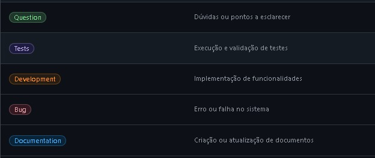

# Metodologia

Para o desenvolvimento deste projeto, adotaremos uma abordagem baseada em metodologias ágeis, com foco em garantir eficiência, organização e flexibilidade ao longo de todo o processo. O principal objetivo é entregar um sistema funcional de forma iterativa, promovendo melhorias contínuas e facilitando adaptações conforme as necessidades forem surgindo.

## Gerenciamento de Projeto
A metodologia ágil escolhida será inspirada nos princípios do Scrum, estruturando o projeto em sprints com duração previamente definida. Cada sprint contará com etapas de planejamento, desenvolvimento, testes e revisão, o que permitirá o acompanhamento constante do progresso e a entrega de incrementos funcionais ao final de cada ciclo.

### Divisão de Papéis

- Scrum Master: André Cabral
- Product Owner: Matheus Gabriel
- Equipe de Desenvolvimento: André Cabral, Davi Souza, Gabriel Dias, Matheus Gabriel, Samuel Cassio, Vinicius Marques
- Equipe de Design: Gabriel Dias, Samuel Cassio

### Controle de Versão

O controle de versão é responsável por rastrear e gerenciar as alterações em um código de software. Dessa forma, as ferramentas de controle de versão auxiliam no gerenciamento das equipes por conta das alterações ao código-fonte ao longo do tempo. O controle de versão e a ferramenta adotados no projeto são, respectivamente, o Git e o GitHub. Os sistemas de Source Control Management (SCM – Gerenciamento de controle do código-fonte) disponibilizam um histórico de execuções e manutenções de desenvolvimento no código, assim como ajudam a resolver conflitos durante a mesclagem de contribuições de várias origens.

Assim sendo, o projeto segue a seguinte convenção para o nome de branches:

- main: versão estável já testada do software;
- hotfix: versão usada para corrigir os lançamentos de produção;
- release: versão em testes do software;
- develop: versão de desenvolvimento do software;
- feature: uma nova funcionalidade do site ou atualização da documentação que precisa ser introduzida.

<figure> 
  
</figure>

### Processo

Para a organização e acompanhamento das atividades do projeto, a equipe seguirá a metodologia Scrum, utilizando ferramentas on-line para gestão de tarefas e comunicação. O GitHub Projects será a principal plataforma de gerenciamento, possibilitando a criação de quadros no formato Kanban, onde cada tarefa poderá ser acompanhada em tempo real por todos os integrantes.

O quadro Kanban do projeto será estruturado da seguinte forma:

To Do: lista que representa o Sprint Backlog, contendo as tarefas planejadas para o sprint atual.

Doing: coluna para as atividades que estão em andamento no momento.

In review: Lista de tarefas que estão realizadas e serão testadas/revisadas.

Done: área destinada às tarefas concluídas, testadas e validadas, estando prontas para entrega ao usuário.

Essa estrutura garante uma visão clara do andamento do projeto, facilita o acompanhamento da equipe e permite ajustes rápidos sempre que necessário, mantendo a organização e a transparência no desenvolvimento da solução.

### Etiquetas

As tarefas serão etiquetadas e seguirão o seguinte esquema de cores/categorias:

<ul>
  <li>Question – Dúvidas ou pontos a esclarecer.</li>
  <li>Tests – Execução e validação de testes.</li>
  <li>Development – Implementação de funcionalidades.</li>
  <li>Bug – Erro ou falha no sistema.</li>
  <li>Documentation – Criação ou atualização de documentos.</li>
</ul>

<figure> 
  
</figure>
  
### Ferramentas

Para auxiliar no desenvolvimento do projeto, nossa equipe fará o uso de ferramentas colaborativas que permitem integração, versionamento e organização eficiente das atividades. O GitHub será utilizado como repositório principal para o código-fonte, controle de versões e documentação, além de servir como ferramenta de gerenciamento das tarefas por meio do GitHub Projects. Já o Figma será utilizado no processo de criação e prototipação das interfaces, permitindo que a equipe de design desenvolva layouts de forma colaborativa e que as telas possam ser validadas antes de sua implementação.

Também, utilizamos Whatsapp para comunicação diaria, e nos reunimos pelo Teams todas as terças para alinhar processos do projeto

Dessa forma, cada membro da equipe terá acesso centralizado aos artefatos do projeto, garantindo transparência, controle e agilidade no desenvolvimento.

| AMBIENTE                            | PLATAFORMA                         | LINK DE ACESSO                         |
|-------------------------------------|------------------------------------|----------------------------------------|
| Repositório de código fonte         | GitHub                             | https://github.com/ICEI-PUC-Minas-PMV-ADS/pmv-ads-2025-2-e1-proj-web-t6-ads-2025-projeto-organizze-grupo4/tree/main/codigo-fonte                          |
| Documentos do projeto               | GitHub                             | https://github.com/ICEI-PUC-Minas-PMV-ADS/pmv-ads-2025-2-e1-proj-web-t6-ads-2025-projeto-organizze-grupo4.git                            |
| Projeto de Interface                | Figma                              | https://www.figma.com/team_invite/redeem/HV7jINOpNOkG3isgcrPboz                            |
| Gerenciamento do Projeto            | GitHub Projects                    | https://github.com/orgs/ICEI-PUC-Minas-PMV-ADS/projects/2437                            
|

