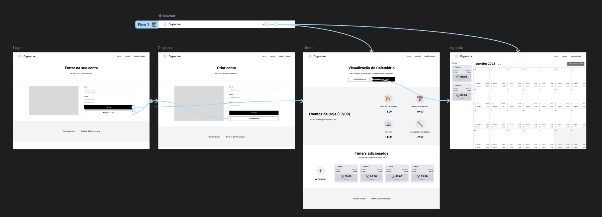
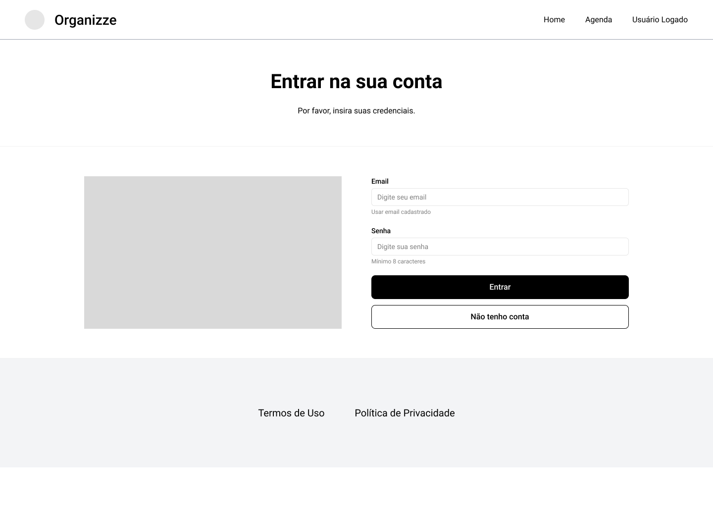
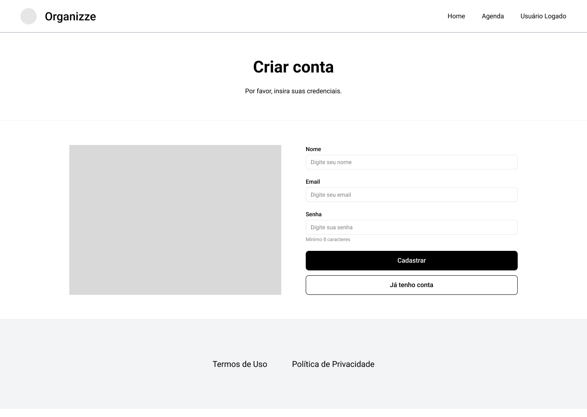
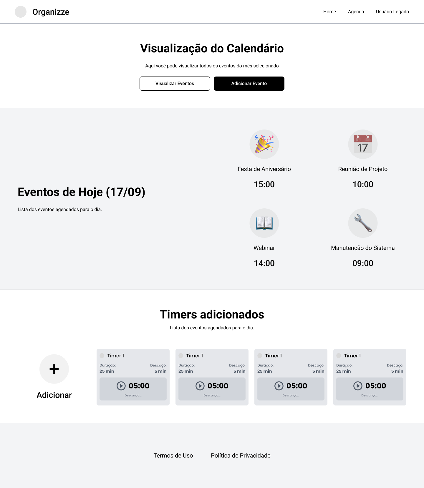
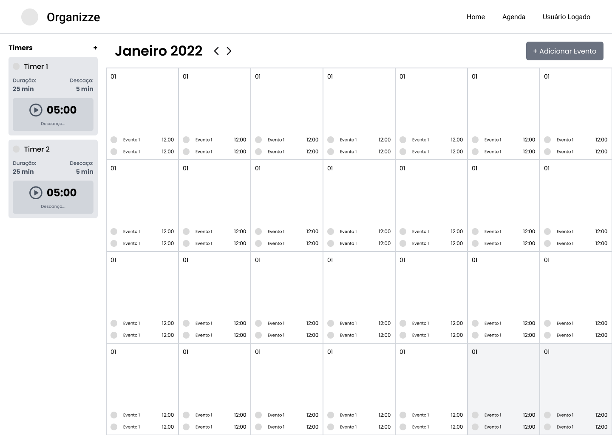

# Projeto de Interface

## User Flow

O fluxograma ilustrado na Figura 1 apresenta o percurso de navegação do usuário através das diferentes telas do sistema. Cada tela que compõe este fluxo é detalhadamente descrita na seção "Protótipo de Baixa Fidelidade" a seguir.

### Visualização Interativa

Para uma experiência completa e interativa do protótipo, acesse o [Protótipo Organizze](https://www.figma.com/proto/jhXvlU2r5yOBTws5OzdP9B/Organizze?node-id=39-5766&t=56KQxCoR9R6XiaUw-1&scaling=min-zoom&content-scaling=fixed&page-id=0%3A1&starting-point-node-id=39%3A5825) pelo Figma.

_Figura 1 - Fluxo de telas_

## Protótipo de baixa fidelidade

As telas do sistema seguem uma estrutura padrão consistente, conforme demonstrado na Figura 2. Esta arquitetura visual é composta por três elementos principais, organizados hierarquicamente:

1. **Cabeçalho**: Região superior da interface onde estão localizados o logotipo da aplicação e o menu de navegação principal, proporcionando acesso às funcionalidades centrais do sistema;
2. **Corpo**: Seção central que apresenta o conteúdo específico de cada tela, adaptando-se dinamicamente conforme a funcionalidade em uso;
3. **Rodapé**: Área inferior destinada às informações institucionais, incluindo direitos autorais e dados complementares da aplicação.

_Figura 2 - Estrutura padrão das telas_

---

### Tela - Login

A tela de login, ilustrada na Figura 3, é a porta de entrada para os usuários acessarem suas contas no sistema.

_Figura 3 - Tela de Login_

### Tela - Cadastro

A tela de cadastro, apresentada na Figura 4, permite que novos usuários criem uma conta no sistema, fornecendo informações essenciais para o registro.

_Figura 4 - Tela de Cadastro_

### Tela - Home

A tela inicial, mostrada na Figura 5, oferece uma visão geral das principais funcionalidades e informações do sistema, servindo como ponto de partida para a navegação do usuário. Nessa tela, é possível visualizar as tarefas agendadas para o dia atual, bem como os timers cadastrados, facilitando o acompanhamento das atividades e a gestão do tempo.

_Figura 5 - Tela Home_

### Tela - Agenda

A tela de agenda, exibida na Figura 6, apresenta uma visão detalhada dos compromissos e eventos programados, permitindo aos usuários gerenciar suas atividades diárias de forma eficiente. Nessa tela, é exibido um calendário mensal, no qual cada dia mostra as tarefas agendadas, facilitando a visualização e o acompanhamento das atividades ao longo do mês. Além disso, há uma listagem de timers associados, possibilitando o controle do tempo dedicado diretamente pela interface da agenda.

_Figura 6 - Tela Agenda_
