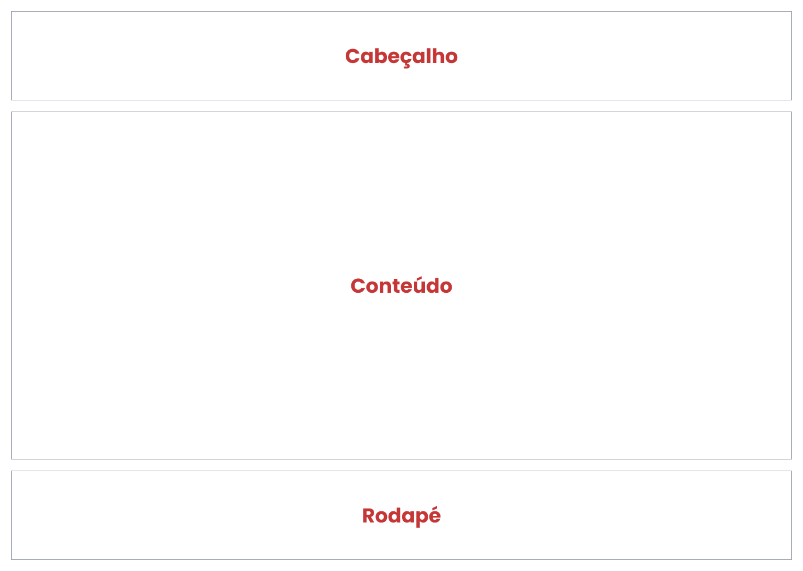
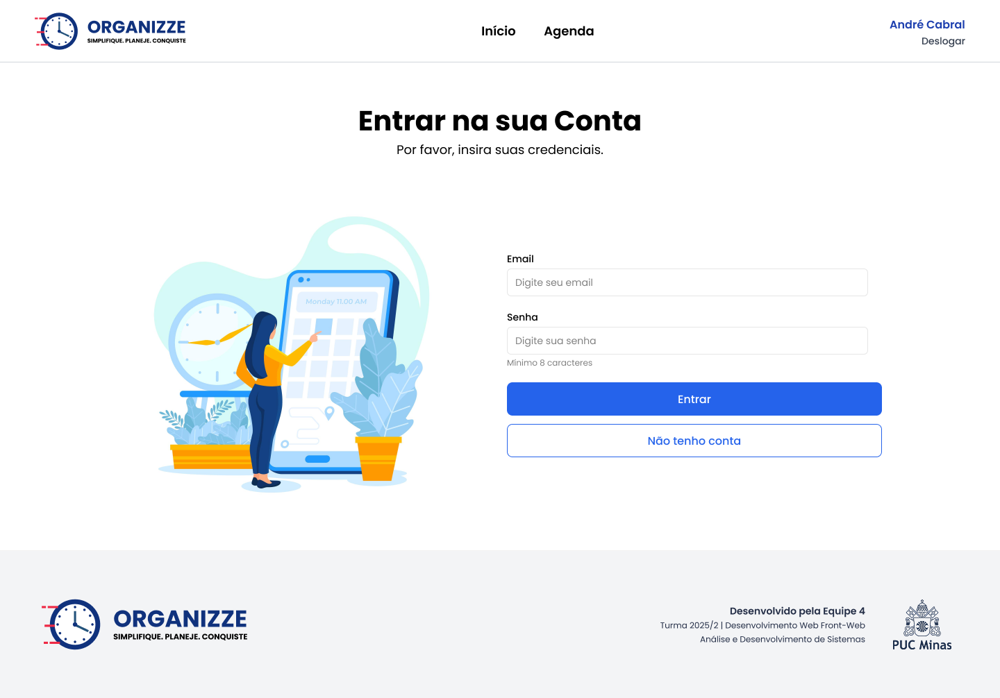
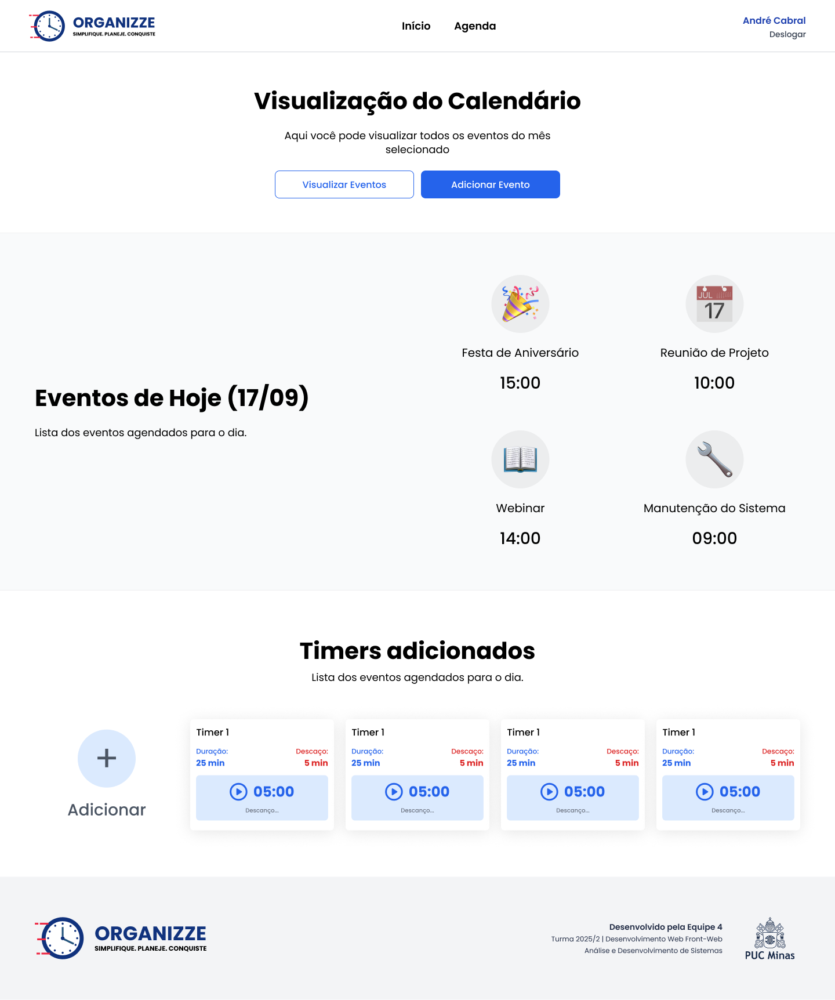
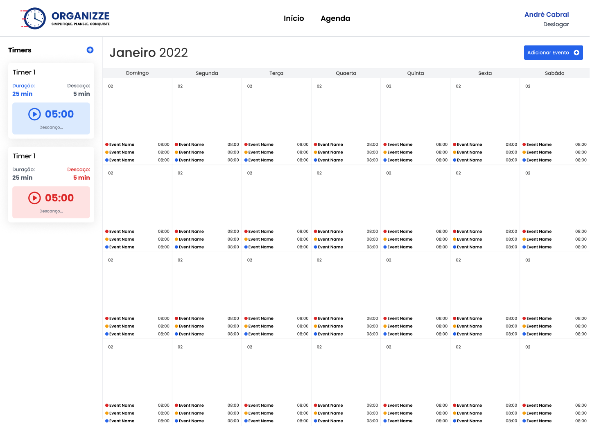
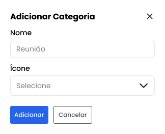

# Template padrão da Aplicação

O template padrão do site vai seguir a estrutura padrão do Wireframe elaborado na seção anterior, conforme mostra a

_Figura 1 - Estrutura padrão das telas_

O mesmo é composto pelos seguintes layouts:

- Tela de Login
- Tela de Cadastro
- Tela Home
- Tela de Agenda

### Tela - Login

Objetivo: Permitir o login do usuário cadastrado.

_Figura 2 - Tela de Login_

- O usuário já cadastrado no site deverá informar o “E-mail” e “Senha” e clicar no botão “Entrar” para fazer o login;
- Ao logar, o sistema redirecionará para a “Home” do site;
- Caso ainda não tenha realizado o cadastro, o usuário deverá clicar em “Não tenho conta” e prosseguir com o cadastro em outra tela.

### Tela - Cadastro

Objetivo: Permitir o cadastro de novos usuários.

_Figura 3 - Tela de Cadastro_

- O usuário deverá informar os dados solicitados: “Nome Completo”, “E-mail” e “Senha” ;
- Após preencher os dados, o usuário deverá clicar no botão “Cadastrar” para finalizar o cadastro;
- Ao cadastrar, o sistema redirecionará para a tela de “Login” do site;
- Caso já tenha realizado o cadastro, o usuário deverá clicar em “Já tenho conta” e prosseguir para o login em outra tela.

### Tela - Home

Objetivo: Apresentar as principais funcionalidades do site.

_Figura 4 - Tela Home_

- A tela inicial do site apresentará o menu de navegação no topo, com as opções: “Home”, “Agenda” e opção para “Deslogar”;
- Abaixo do menu, haverá uma seção para visualização dos eventos ou cadastrar novos eventos;
- Será possível visualizar os eventos do dia e timers adicionados pelo usuário;

### Tela - Agenda

Objetivo: Permitir o gerenciamento completo da agenda do usuário.

_Figura 5 - Tela Agenda_

- Usuário poderá visualizar a agenda completa com os eventos cadastrados;
- Usuário poderá visualizar e controlar os timers adicionados;
- Usuário poderá adicionar novos eventos e timers através de botões específicos na tela;

### Modais

O sistema utiliza modais para operações específicas, mantendo o usuário na mesma tela:

#### Modal - Adicionar e Editar Evento

Objetivo: Permitir a criação e edição dos eventos.

_Figura 6 - Modal Adicionar Evento_

_Figura 7 - Modal Editar Evento_

#### Modal - Adicionar e Editar Timer

Objetivo: Permitir a criação e edição dos timers.

_Figura 8 - Modal Adicionar Timer_

_Figura 9 - Modal Editar Timer_

#### Modal Listage, Adicionar e Editar Eventos Recorrente

Objetivo: Permitir a criação, edição e listagem dos eventos recorrentes.

_Figura 10 - Modal Listar Evento Recorrente_

_Figura 11 - Modal Adicionar Evento Recorrente_

_Figura 12 - Modal Editar Evento Recorrente_

#### Modal Listagem, Adicionar e Editar Categorias

Objetivo: Permitir a criação, edição e listagem das categorias.

_Figura 13 - Modal Listar Categoria_

_Figura 14 - Modal Adicionar Categoria_

_Figura 15 - Modal Editar Categoria_
